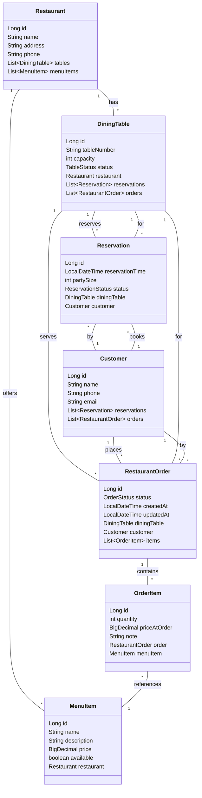
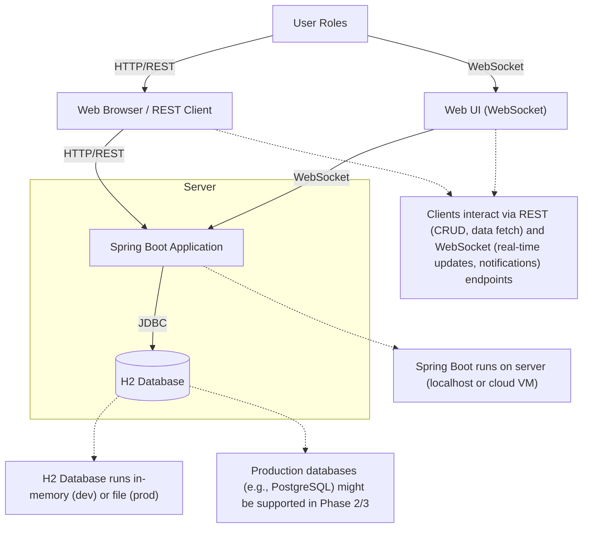
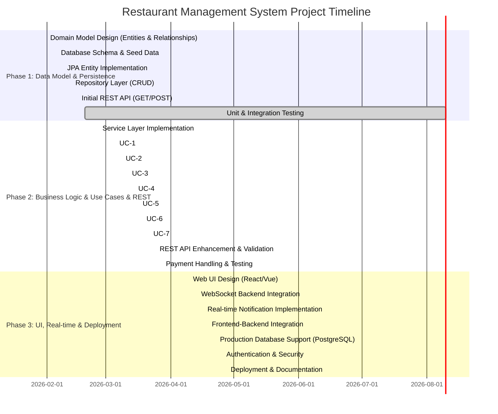

# Restaurant Order Management System (Phase 1)

Java + Spring Boot • Enterprise Architecture Project • Dine-in, multi-role workflow

**Phase 1 Objective:** Build a foundational persistence layer with JPA entities, ORM mappings, Spring Data repositories, and basic REST endpoints to prove the data model works in a real relational database.

---

## 📋 Project Overview

### Vision
A dine-in restaurant system supporting table-based ordering, kitchen fulfillment, and order/payment tracking. Built as a layered Spring Boot application, expandable across 3 phases:

- **Phase 1 (Current):** Data model + ORM + repositories + basic REST
- **Phase 2 (Planned):** Business services + validation workflows
- **Phase 3 (Planned):** UI + full deployment polish

### User Roles
- **Customer:** Browse menu, place orders, track status
- **Waiter/Staff:** Manage reservations, tables, orders, payment
- **Kitchen:** Queue view, mark orders ready
- **Manager:** Manage menu, tables, users

### Order Lifecycle
`DRAFT → PLACED → IN_PROGRESS → READY → SERVED → REQUESTED_CHECK → PAID → CLOSED`

---

## 🗂️ Data Model & Architecture

### Core Entities (7 total)

| Entity | Purpose | Key Attributes |
|--------|---------|----------------|
| **Restaurant** | Container & settings | id, name, address, phone, email, openTime, closeTime |
| **DiningTable** | Physical seating | id, tableNumber, capacity, seatingArrangement, status |
| **MenuItem** | Menu item | id, name, description, category, price, preparationTime |
| **Customer** | Guest profile | id, firstName, lastName, email, phone, registrationDate |
| **Reservation** | Booking | id, reservationDate, partySize, status, guestName, guestPhone |
| **RestaurantOrder** | Customer order | id, orderDate, status, totalAmount, notes |
| **OrderItem** | Order line item | id, quantity, priceAtOrder, preparationNotes, status |

### Entity Relationships

```
Restaurant (1) ─────────── (N) DiningTable
    │                           │
    │                           ├─ (1:N) Reservation ─ (N:1) Customer
    │                           │
    │                           └─ (1:N) RestaurantOrder ─ (N:1) Customer
    │                                    │
    └─ (1:N) MenuItem                    └─ (1:N) OrderItem ─ (N:1) MenuItem
```

**Key Foreign Keys:**
| Parent | Child | Relationship |
|--------|-------|--------------|
| Restaurant | DiningTable, MenuItem, Reservation | 1:N |
| DiningTable | RestaurantOrder, Reservation | 1:N |
| RestaurantOrder | OrderItem | 1:N |
| Customer | RestaurantOrder, Reservation | 1:N |
| MenuItem | OrderItem | 1:N |

### Repository Layer

Each entity has a `JpaRepository` interface providing CRUD + custom query support:

| Repository | Capabilities |
|------------|--------------|
| `RestaurantRepository` | CRUD, restaurant queries |
| `DiningTableRepository` | Status filtering, availability lookup |
| `MenuItemRepository` | Category search, availability checks |
| `CustomerRepository` | Search by email/phone, preference lookup |
| `ReservationRepository` | Date range queries, status filtering |
| `RestaurantOrderRepository` | Status tracking, customer history |
| `OrderItemRepository` | Sales analytics, item queries |

---

## 🛠️ Tech Stack & Quick Start

### Requirements
- Java 17
- Spring Boot (Web + Data JPA)
- H2 in-memory database
- Maven 3.6+

### Build & Run

```bash
# Build without tests
.\mvnw -DskipTests package

# Start application
.\mvnw spring-boot:run

# Run tests
.\mvnw test

# Clean build
.\mvnw clean
```

**Application starts on:** `http://localhost:8080`  
**H2 Console:** `http://localhost:8080/h2-console`  
**JDBC URL:** `jdbc:h2:mem:restaurantdb;DB_CLOSE_DELAY=-1;DB_CLOSE_ON_EXIT=FALSE`

Seed data loads automatically from [src/main/resources/data.sql](src/main/resources/data.sql)

---


## 🔐 Auth & Security Quick Test

### Register a New User
```powershell
Invoke-RestMethod -Uri "http://localhost:8080/api/auth/register" `
    -Method Post `
    -Headers @{"Content-Type"="application/json"} `
    -Body '{"username":"testuser","password":"123456","roles":["USER"]}'
```

### Login and Get JWT Token
```powershell
$response = Invoke-RestMethod -Uri "http://localhost:8080/api/auth/login" `
    -Method Post `
    -Headers @{"Content-Type"="application/json"} `
    -Body '{"username":"testuser","password":"123456"}'
$response.token
```

### Access Protected Endpoint with Token
```powershell
Invoke-RestMethod -Uri "http://localhost:8080/api/orders" `
    -Headers @{"Authorization"="Bearer <your_full_token_here>"}
```
> Replace `<your_full_token_here>` with the full string from `$response.token` above.

### Forgot Password & Reset Password
```powershell
# Request password reset link
Invoke-RestMethod -Uri "http://localhost:8080/api/auth/forgot-password" `
    -Method Post `
    -Headers @{"Content-Type"="application/json"} `
    -Body '{"emailOrUsername":"testuser"}'

# Use the returned token to reset password
Invoke-RestMethod -Uri "http://localhost:8080/api/auth/reset-password" `
    -Method Post `
    -Headers @{"Content-Type"="application/json"} `
    -Body '{"token":"<token>","newPassword":"newpass"}'
```

---

## 📡 REST API Overview

| Resource | Endpoints | Methods |
|----------|-----------|---------|
| **Restaurant** | `/api/restaurants`, `/api/restaurants/{id}` | GET, POST |
| **DiningTable** | `/api/tables`, `/api/tables/{id}` | GET, POST |
| **MenuItem** | `/api/menu-items`, `/api/menu-items/{id}` | GET, POST |
| **Customer** | `/api/customers`, `/api/customers/{id}` | GET, POST |
| **Reservation** | `/api/reservations`, `/api/reservations/{id}` | GET, POST |
| **RestaurantOrder** | `/api/orders`, `/api/orders/{id}` | GET, POST |

**Example: Create Order with Items**
```json
POST /api/orders
{
  "diningTableId": 1,
  "customerId": 1,
  "status": "PLACED",
  "items": [
    {
      "menuItemId": 1,
      "quantity": 2,
      "priceAtOrder": 12.50,
      "note": "No onions"
    }
  ]
}
```

---

## 🎬 Presentation & Demo Script

### 1. Setup & Preparation (5 minutes)

**Start Application**
```bash
.\mvnw spring-boot:run
```
Wait for: `Tomcat started on port 8080`

**Verify Database Seed**
- Open H2 console: http://localhost:8080/h2-console
- Run: `SELECT COUNT(*) FROM RESTAURANT;`
- Should show 2-3 seeded restaurants

**Import Postman Files**
- Collection: [postman/Restaurant_Order_Management_Phase1.postman_collection.json](postman/Restaurant_Order_Management_Phase1.postman_collection.json)
- Environment: [postman/Restaurant_Order_Management_Phase1.postman_environment.json](postman/Restaurant_Order_Management_Phase1.postman_environment.json)
- Select environment in Postman

### 2. Live Demo Sequence (Follow in Order)

| # | Endpoint | Action | Purpose |
|---|----------|--------|---------|
| 1 | `GET /api/restaurants` | Show all restaurants | Demonstrate seeded data |
| 2 | `GET /api/restaurants/{id}` | Pick one restaurant | Show entity details |
| 3 | `GET /api/menu-items` | Browse menu | Show relationships (Restaurant → Items) |
| 4 | `GET /api/tables` | List tables | Show table status & capacity |
| 5 | `POST /api/customers` | Create new customer | Verify DTO validation & DB save |
| 6 | `GET /api/customers` | Retrieve customers | Confirm persistence |
| 7 | `POST /api/reservations` | Book table for customer | Test foreign key relationships |
| 8 | `POST /api/orders` | Place order with items | Demonstrate nested OrderItems save |
| 9 | `GET /api/orders/{id}` | Retrieve order | Show ORM loaded relationships |
| 10 | Check H2 console | Query order data | Validate database consistency |

### 3. Key Demo Highlights

✅ **Data Persistence:** Create customer → retrieve it → prove saved to H2  
✅ **ORM in Action:** Create order with nested OrderItems → verify all saved correctly  
✅ **Validation:** Try invalid data (negative quantity) → show DTO rejects it (400 Bad Request)  
✅ **Relationships:** Get order → shows all OrderItems with MenuItem details (ORM eager/lazy loading working)  
✅ **Foreign Keys:** Try referencing invalid customer ID → H2 constraint violation  
✅ **Architecture:** Explain Repository pattern → will support service layer in Phase 2  

### 4. H2 Console Verification Queries

Paste these into H2 console to verify demo data:

```sql
-- View all restaurants
SELECT * FROM RESTAURANT;

-- Check created customer
SELECT * FROM CUSTOMER WHERE EMAIL LIKE '%demo%';

-- View reservations
SELECT r.*, c.FIRST_NAME, t.TABLE_NUMBER 
FROM RESERVATION r
JOIN CUSTOMER c ON r.CUSTOMER_ID = c.ID
JOIN DINING_TABLE t ON r.DINING_TABLE_ID = t.ID;

-- Check order with items
SELECT o.*, COUNT(oi.ID) as item_count
FROM RESTAURANT_ORDER o
LEFT JOIN ORDER_ITEM oi ON o.ID = oi.RESTAURANT_ORDER_ID
GROUP BY o.ID;

-- View table occupancy
SELECT TABLE_NUMBER, STATUS, CAPACITY FROM DINING_TABLE;
```

### 5. Success Criteria Checklist

| ✓ | Criterion | Expected | How to Verify |
|---|-----------|----------|---------------|
| - | **App Starts** | No errors in console | Logs show "Started RestaurantManagementSystemApplication" |
| - | **GET /api/restaurants** | 200 response with JSON array | Postman shows green 200 |
| - | **POST /api/customers** | New record saved & returned with ID | ID appears in subsequent GET |
| - | **DTOs Validated** | POST invalid data → 400 Bad Request | Error message in response |
| - | **Relationships Work** | Order contains OrderItems with MenuItem details | GET /api/orders/{id} shows nested data |
| - | **FK Constraints** | Invalid references rejected | H2 throws constraint error |
| - | **Data Consistency** | No orphaned records | H2 queries return expected counts |

### 6. Presentation Narrative

*"Today we're demonstrating Phase 1 of our Restaurant Order Management System—the foundational persistence layer. We've modeled a complete restaurant workflow: restaurants own menus and tables; customers make reservations and place orders; orders contain individual items from the menu. All 7 entities are mapped in a relational schema with strict foreign key constraints. Using Spring Boot and Spring Data JPA, we provide repositories for safe, validated database access. In this demo, we'll prove the model works: placing a live order, watching it cascade through the database, and retrieving it with all relationships intact. This foundation lets Phase 2 add business logic—reservation conflicts, order workflows, payments—without rearchitecting the core data model."*

---

## 📁 Project Structure

```
src/main/java/com/example/restaurant/
├── RestaurantManagementSystemApplication.java
├── controller/          (REST endpoint handlers)
│   ├── RestaurantController.java
│   ├── DiningTableController.java
│   ├── MenuItemController.java
│   ├── CustomerController.java
│   ├── ReservationController.java
│   ├── OrderController.java
│   └── dto/             (Request/Response DTOs with validation)
├── model/              (JPA @Entity classes)
│   ├── Restaurant.java
│   ├── DiningTable.java
│   ├── MenuItem.java
│   ├── Customer.java
│   ├── Reservation.java
│   ├── RestaurantOrder.java
│   ├── OrderItem.java
│   └── enums/          (OrderStatus, ReservationStatus, TableStatus)
├── repository/         (Spring Data JPA interfaces)
│   ├── RestaurantRepository.java
│   ├── DiningTableRepository.java
│   ├── MenuItemRepository.java
│   ├── CustomerRepository.java
│   ├── ReservationRepository.java
│   ├── RestaurantOrderRepository.java
│   └── OrderItemRepository.java
└── service/           (Business logic—placeholder for Phase 2)
    ├── RestaurantService.java
    ├── DiningTableService.java
    ├── MenuItemService.java
    ├── CustomerService.java
    ├── ReservationService.java
    └── OrderService.java

src/main/resources/
├── application.properties  (Spring Boot config)
└── data.sql               (H2 seed data)
```

---

## 🔧 Postman Testing

Import and use the provided Postman collection to test all endpoints:

- **Collection:** [postman/Restaurant_Order_Management_Phase1.postman_collection.json](postman/Restaurant_Order_Management_Phase1.postman_collection.json)
- **Environment:** [postman/Restaurant_Order_Management_Phase1.postman_environment.json](postman/Restaurant_Order_Management_Phase1.postman_environment.json)

Requests are organized in order: Restaurants → Tables → MenuItems → Customers → Reservations → Orders.

---

## 📝 Implementation Summary

### What's Built (Phase 1)
- ✅ 7 JPA entities with column constraints & validation
- ✅ Bidirectional ORM mappings (OneToMany, ManyToOne, foreign keys)
- ✅ 7 Spring Data JPA repositories
- ✅ 6 REST controller endpoints (GET/POST)
- ✅ DTOs with Bean Validation for input safety
- ✅ H2 in-memory database with seed data
- ✅ Service layer skeleton (methods ready for Phase 2 business logic)

### What's Next (Phase 2)
- Business logic in services (validation, conflict detection)
- Order status workflows
- Reservation conflict handling
- Payment reconciliation

### What's Later (Phase 3)
- Web UI (HTML/CSS/JavaScript or React)
- Authentication & authorization
- Advanced filtering & search
- Performance optimization

---

## 📚 References

- [Spring Boot Documentation](https://spring.io/projects/spring-boot)
- [Spring Data JPA](https://spring.io/projects/spring-data-jpa)
- [Jakarta Persistence (JPA)](https://jakarta.ee/specifications/persistence/)
- [H2 Database](http://www.h2database.com/)

---

## 📊 Architecture Diagrams & Project Timeline

### 1. Domain Model Diagram



### 2. Deployment Model Diagram



### 3. Gantt Chart (Project Timeline)



**Status:** Phase 1 Complete (Data Model + Repositories + Basic REST)  
**Last Updated:** February 2026  
**Maintainer:** Development Team
