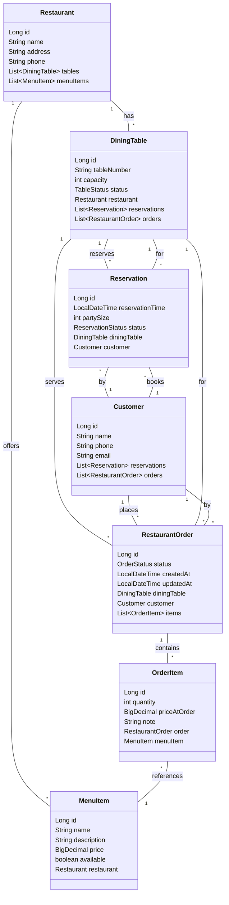
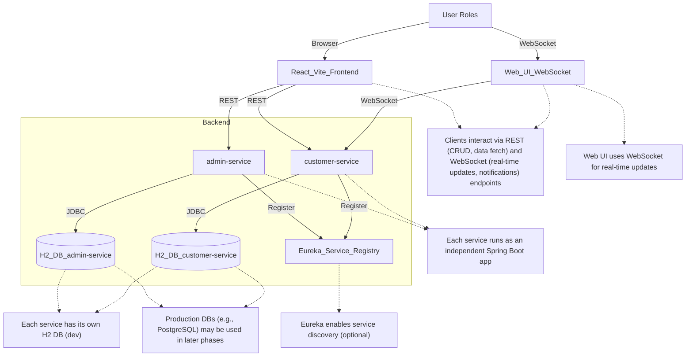
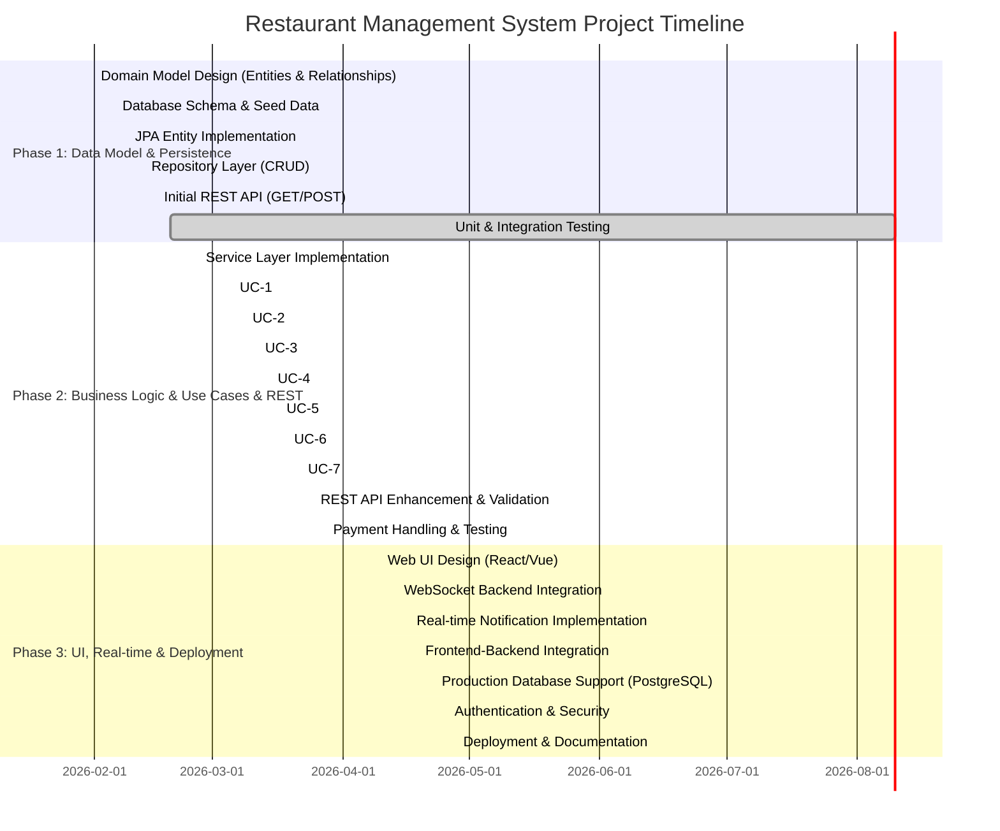

## 🏗️ Project Structure & Multi-Module Overview

This project now uses a Maven multi-module microservice architecture, including:

- **customer-service**: Customer-facing service (registration, login, ordering, order queries, password reset, etc.)
- **admin-service**: Admin-side service (menu, table, user, and order management)
- **frontend**: React + Vite frontend (in the `frontend/` directory, start separately with `npm run dev`)
- **postman/**: API test collections
- **docs/**: Requirements, architecture, use cases, and design documents

The top-level `pom.xml` manages dependencies and versions. Each service module has its own Spring Boot entry point, configuration, and dependencies. Service discovery is supported via **Eureka** (Spring Cloud Netflix Eureka). If deployed, start Eureka first, then register both services.

**Startup Quick Guide:**
1. Start Eureka server (if used), then start `admin-service` and `customer-service`.
2. Start the frontend (`frontend/`) with `npm run dev` (default port 5173).
3. API endpoints for each service are described in the REST API Overview below.

---

# Restaurant Order Management System (Phase 1)

Java + Spring Boot • Microservice Architecture • Dine-in, multi-role workflow

**Phase 1 Objective:** Build a foundational persistence layer with JPA entities, ORM mappings, Spring Data repositories, and basic REST endpoints to prove the data model works in a real relational database.

---

## 📋 Project Overview

### Vision
A dine-in restaurant system supporting table-based ordering, kitchen fulfillment, and order/payment tracking. Built as a microservice-based Spring Boot application, expandable across 3 phases:

- **Phase 1 (Current):** Data model + ORM + repositories + basic REST (split into customer-service and admin-service)
- **Phase 2 (Planned):** Business services + validation workflows
- **Phase 3 (Planned):** UI + full deployment polish

### User Roles
- **Customer:** Browse menu, place orders, track status
- **Waiter/Staff:** Manage reservations, tables, orders, payment
- **Kitchen:** Queue view, mark orders ready
- **Manager:** Manage menu, tables, users

### Order Lifecycle
`DRAFT → PLACED → IN_PROGRESS → READY → SERVED → REQUESTED_CHECK → PAID → CLOSED`

---

## 🗂️ Data Model & Architecture

### Core Entities (7 total)

| Entity | Purpose | Key Attributes |
|--------|---------|----------------|
| **Restaurant** | Container & settings | id, name, address, phone, email, openTime, closeTime |
| **DiningTable** | Physical seating | id, tableNumber, capacity, seatingArrangement, status |
| **MenuItem** | Menu item | id, name, description, category, price, preparationTime |
| **Customer** | Guest profile | id, firstName, lastName, email, phone, registrationDate |
| **Reservation** | Booking | id, reservationDate, partySize, status, guestName, guestPhone |
| **RestaurantOrder** | Customer order | id, orderDate, status, totalAmount, notes |
| **OrderItem** | Order line item | id, quantity, priceAtOrder, preparationNotes, status |

### Entity Relationships

```
Restaurant (1) ─────────── (N) DiningTable
    │                           │
    │                           ├─ (1:N) Reservation ─ (N:1) Customer
    │                           │
    │                           └─ (1:N) RestaurantOrder ─ (N:1) Customer
    │                                    │
    └─ (1:N) MenuItem                    └─ (1:N) OrderItem ─ (N:1) MenuItem
```

**Key Foreign Keys:**
| Parent | Child | Relationship |
|--------|-------|--------------|
| Restaurant | DiningTable, MenuItem, Reservation | 1:N |
| DiningTable | RestaurantOrder, Reservation | 1:N |
| RestaurantOrder | OrderItem | 1:N |
| Customer | RestaurantOrder, Reservation | 1:N |
| MenuItem | OrderItem | 1:N |

### Repository Layer

Each entity has a `JpaRepository` interface providing CRUD + custom query support, now split between customer-service and admin-service as appropriate:

| Repository | Service Module | Capabilities |
|------------|---------------|--------------|
| `RestaurantRepository` | admin-service | CRUD, restaurant queries |
| `DiningTableRepository` | admin-service | Status filtering, availability lookup |
| `MenuItemRepository` | admin-service | Category search, availability checks |
| `CustomerRepository` | customer-service | Search by email/phone, preference lookup |
| `ReservationRepository` | customer-service | Date range queries, status filtering |
| `RestaurantOrderRepository` | customer-service | Status tracking, customer history |
| `OrderItemRepository` | customer-service | Sales analytics, item queries |

---

## 🛠️ Tech Stack & Quick Start

### Requirements
- Java 17
- Spring Boot (Web, Data JPA, Security, Cloud Eureka)
- H2 in-memory database
- Maven 3.6+
- React + Vite (frontend, optional)

### Build & Run

```bash
# Build all modules without tests
./mvnw -DskipTests package

# Start Eureka server (if used)
# Start admin-service
cd admin-service && ../mvnw spring-boot:run
# Start customer-service
cd ../customer-service && ../mvnw spring-boot:run
# (Optional) Start frontend
cd ../frontend && npm install && npm run dev
```

**Default ports:**
- admin-service: `http://localhost:8081` (example, check your config)
- customer-service: `http://localhost:8082` (example, check your config)
- Eureka: `http://localhost:8761` (if enabled)
- Frontend: `http://localhost:5173`

**H2 Console:** Each service exposes its own H2 console, e.g. `http://localhost:8082/h2-console`

Seed data loads automatically from each service's `src/main/resources/data.sql`

---

## 🔐 Auth & Security Quick Test

### Register a New User (customer-service)
```powershell
Invoke-RestMethod -Uri "http://localhost:8082/api/auth/register" `
    -Method Post `
    -Headers @{"Content-Type"="application/json"} `
    -Body '{"username":"testuser","password":"123456","roles":["USER"]}'
```

### Login and Get JWT Token (customer-service)
```powershell
$response = Invoke-RestMethod -Uri "http://localhost:8082/api/auth/login" `
    -Method Post `
    -Headers @{"Content-Type"="application/json"} `
    -Body '{"username":"testuser","password":"123456"}'
$response.token
```

### Access Protected Endpoint with Token (customer-service)
```powershell
Invoke-RestMethod -Uri "http://localhost:8082/api/orders" `
    -Headers @{"Authorization"="Bearer <your_full_token_here>"}
```
> Replace `<your_full_token_here>` with the full string from `$response.token` above.

### Forgot Password & Reset Password (customer-service)
```powershell
# Request password reset link
Invoke-RestMethod -Uri "http://localhost:8082/api/auth/forgot-password" `
    -Method Post `
    -Headers @{"Content-Type"="application/json"} `
    -Body '{"emailOrUsername":"testuser"}'

# Use the returned token to reset password
Invoke-RestMethod -Uri "http://localhost:8082/api/auth/reset-password" `
    -Method Post `
    -Headers @{"Content-Type"="application/json"} `
    -Body '{"token":"<token>","newPassword":"newpass"}'
```

---

## 📡 REST API Overview

| Resource | Endpoints (example) | Methods | Service Module |
|----------|---------------------|---------|---------------|
| **Restaurant** | `/api/restaurants`, `/api/restaurants/{id}` | GET, POST | admin-service |
| **DiningTable** | `/api/tables`, `/api/tables/{id}` | GET, POST | admin-service |
| **MenuItem** | `/api/menu-items`, `/api/menu-items/{id}` | GET, POST | admin-service |
| **Customer** | `/api/customers`, `/api/customers/{id}` | GET, POST | customer-service |
| **Reservation** | `/api/reservations`, `/api/reservations/{id}` | GET, POST | customer-service |
| **RestaurantOrder** | `/api/orders`, `/api/orders/{id}` | GET, POST | customer-service |

**Example: Create Order with Items (customer-service)**
```json
POST /api/orders
{
  "diningTableId": 1,
  "customerId": 1,
  "status": "PLACED",
  "items": [
    {
      "menuItemId": 1,
      "quantity": 2,
      "priceAtOrder": 12.50,
      "note": "No onions"
    }
  ]
}
```

---

## 🎬 Presentation & Demo Script (Phase 1)

### 1. Setup & Preparation (5 minutes)

**Start Services**
```bash
# Start Eureka server (if used)
# Start admin-service
cd admin-service && ../mvnw spring-boot:run
# Start customer-service
cd ../customer-service && ../mvnw spring-boot:run
# (Optional) Start frontend
cd ../frontend && npm install && npm run dev
```
Wait for: `Tomcat started on port 8081` (admin-service), `Tomcat started on port 8082` (customer-service)

**Verify Database Seed**
- Open H2 console for each service:
  - admin-service: http://localhost:8081/h2-console
  - customer-service: http://localhost:8082/h2-console
- Run: `SELECT COUNT(*) FROM RESTAURANT;` (admin-service)
- Should show 2-3 seeded restaurants

**Import Postman Files**
- Collection: [postman/Restaurant_Order_Management_Phase1.postman_collection.json](postman/Restaurant_Order_Management_Phase1.postman_collection.json)
- Environment: [postman/Restaurant_Order_Management_Phase1.postman_environment.json](postman/Restaurant_Order_Management_Phase1.postman_environment.json)
- Select environment in Postman

### 2. Live Demo Sequence (Follow in Order)

| # | Endpoint | Service | Action | Purpose |
|---|----------|---------|--------|---------|
| 1 | `GET /api/restaurants` | admin-service | Show all restaurants | Demonstrate seeded data |
| 2 | `GET /api/restaurants/{id}` | admin-service | Pick one restaurant | Show entity details |
| 3 | `GET /api/menu-items` | admin-service | Browse menu | Show relationships (Restaurant → Items) |
| 4 | `GET /api/tables` | admin-service | List tables | Show table status & capacity |
| 5 | `POST /api/customers` | customer-service | Create new customer | Verify DTO validation & DB save |
| 6 | `GET /api/customers` | customer-service | Retrieve customers | Confirm persistence |
| 7 | `POST /api/reservations` | customer-service | Book table for customer | Test foreign key relationships |
| 8 | `POST /api/orders` | customer-service | Place order with items | Demonstrate nested OrderItems save |
| 9 | `GET /api/orders/{id}` | customer-service | Retrieve order | Show ORM loaded relationships |
| 10 | Check H2 console | both | Query order data | Validate database consistency |

### 3. Key Demo Highlights

✅ **Data Persistence:** Create customer → retrieve it → prove saved to H2  
✅ **ORM in Action:** Create order with nested OrderItems → verify all saved correctly  
✅ **Validation:** Try invalid data (negative quantity) → show DTO rejects it (400 Bad Request)  
✅ **Relationships:** Get order → shows all OrderItems with MenuItem details (ORM eager/lazy loading working)  
✅ **Foreign Keys:** Try referencing invalid customer ID → H2 constraint violation  
✅ **Architecture:** Explain Repository pattern → will support service layer in Phase 2  

### 4. H2 Console Verification Queries

Paste these into the appropriate H2 console to verify demo data:

```sql
-- View all restaurants (admin-service)
SELECT * FROM RESTAURANT;

-- Check created customer (customer-service)
SELECT * FROM CUSTOMER WHERE EMAIL LIKE '%demo%';

-- View reservations (customer-service)
SELECT r.*, c.FIRST_NAME, t.TABLE_NUMBER 
FROM RESERVATION r
JOIN CUSTOMER c ON r.CUSTOMER_ID = c.ID
JOIN DINING_TABLE t ON r.DINING_TABLE_ID = t.ID;

-- Check order with items (customer-service)
SELECT o.*, COUNT(oi.ID) as item_count
FROM RESTAURANT_ORDER o
LEFT JOIN ORDER_ITEM oi ON o.ID = oi.RESTAURANT_ORDER_ID
GROUP BY o.ID;

-- View table occupancy (admin-service)
SELECT TABLE_NUMBER, STATUS, CAPACITY FROM DINING_TABLE;
```

### 5. Success Criteria Checklist

| ✓ | Criterion | Expected | How to Verify |
|---|-----------|----------|---------------|
| - | **All Services Start** | No errors in console | Logs show "Started ...Application" for both services |
| - | **GET /api/restaurants** | 200 response with JSON array | Postman shows green 200 (admin-service) |
| - | **POST /api/customers** | New record saved & returned with ID | ID appears in subsequent GET (customer-service) |
| - | **DTOs Validated** | POST invalid data → 400 Bad Request | Error message in response |
| - | **Relationships Work** | Order contains OrderItems with MenuItem details | GET /api/orders/{id} shows nested data (customer-service) |
| - | **FK Constraints** | Invalid references rejected | H2 throws constraint error |
| - | **Data Consistency** | No orphaned records | H2 queries return expected counts |

### 6. Presentation Narrative

*"Today we're demonstrating Phase 1 of our Restaurant Order Management System—the foundational persistence layer. We've modeled a complete restaurant workflow: restaurants own menus and tables; customers make reservations and place orders; orders contain individual items from the menu. All 7 entities are mapped in a relational schema with strict foreign key constraints. Using Spring Boot and Spring Data JPA, we provide repositories for safe, validated database access. In this demo, we'll prove the model works: placing a live order, watching it cascade through the database, and retrieving it with all relationships intact. This foundation lets Phase 2 add business logic—reservation conflicts, order workflows, payments—without rearchitecting the core data model."*

---

## 🎥 Presentation & Demo Script (Phase 2)

### 1. Security Features Demo
- **User Registration (customer-service):**
  - Show registering a new user via frontend or Postman (`/api/auth/register` on customer-service).
  - Demonstrate registration with different roles (USER, ADMIN).
- **Authentication (customer-service):**
  - Login as a user and show JWT token returned (`/api/auth/login` on customer-service).
  - Show login failure with wrong credentials.
- **Authorization (customer-service & admin-service):**
  - Access a protected endpoint/page as a logged-in user (e.g., `/api/orders` for USER, `/api/menu-items` for ADMIN).
  - Attempt to access admin-only endpoint as USER and show permission denied.
- **Password Reminder (customer-service):**
  - Use "Forgot Password" on frontend or `/api/auth/forgot-password` (customer-service) to request a reset link.
  - Use the reset token to set a new password via `/api/auth/reset-password` (customer-service).

### 2. Bearer Token Usage
- Explain that after login, the frontend stores the JWT token and attaches it as an `Authorization: Bearer <token>` header for all protected API requests.
- Show a request in browser dev tools or Postman with the Bearer token in the header.
- Mention that the backend (customer-service/admin-service) validates the token on every request and extracts user roles for authorization.

### 3. Service Discovery (Eureka)
- Explain that in this microservice setup, each service registers with a discovery server (Eureka).
- Show the Eureka dashboard (`http://localhost:8761`) with both `customer-service` and `admin-service` registered.
- Optionally, show a sample `application.yml` Eureka client config for one service:

```yaml
spring:
  application:
    name: customer-service
  cloud:
    discovery:
      enabled: true
    eureka:
      client:
        service-url:
          defaultZone: http://localhost:8761/eureka/
```

### 4. Scalability & Resilience Demo (Stress Test)
- Introduce Gatling (or similar tool) for load testing.
- Show a simple Gatling script that simulates multiple users logging in, placing orders, and accessing protected endpoints (against customer-service and admin-service APIs).
- Run the test and display results: response times, error rates, throughput.
- Discuss how the backend handles concurrent requests and how stateless JWT authentication supports horizontal scaling.
- Optionally, mention resilience patterns (retry, circuit breaker) for future microservices.

---

**Tip:** Record the above steps as a video, narrating each feature and showing both frontend and backend behavior, including API calls, error handling, and system response under load.

---

## 📁 Project Structure

```
restaurant-management-system/
├── customer-service/
│   ├── src/main/java/com/example/customerservice/
│   │   ├── CustomerServiceApplication.java
│   │   ├── controller/
│   │   ├── model/
│   │   ├── repository/
│   │   ├── security/
│   │   └── service/
│   └── src/main/resources/
│       ├── application.properties
│       └── data.sql
├── admin-service/
│   ├── src/main/java/com/example/adminservice/
│   │   ├── AdminServiceApplication.java
│   │   ├── controller/
│   │   ├── model/
│   │   ├── repository/
│   │   ├── security/
│   │   └── service/
│   └── src/main/resources/
│       ├── application.properties
│       └── data.sql
├── frontend/           # React + Vite frontend (optional)
├── postman/            # Postman API collections
├── docs/               # Documentation
├── pom.xml             # Parent Maven config
└── README.md
```

---

## 🔧 Postman Testing


Import and use the provided Postman collection to test endpoints for both microservices:

- **Collection:** [postman/Restaurant_Order_Management_Phase1.postman_collection.json](postman/Restaurant_Order_Management_Phase1.postman_collection.json)
- **Environment:** [postman/Restaurant_Order_Management_Phase1.postman_environment.json](postman/Restaurant_Order_Management_Phase1.postman_environment.json)

**How to use:**
- Make sure both `admin-service` (default: http://localhost:8081) and `customer-service` (default: http://localhost:8082) are running.
- Select the environment in Postman and update the base URLs if your ports/config differ.
- Requests are organized by resource and mapped to the correct service:
  - **admin-service:** Restaurants, Tables, MenuItems
  - **customer-service:** Customers, Reservations, Orders

Requests are organized in order: Restaurants → Tables → MenuItems (admin-service) → Customers → Reservations → Orders (customer-service).

---

## 📝 Implementation Summary

### What's Built (Phase 1)
- ✅ 7 JPA entities with column constraints & validation (split across admin-service & customer-service)
- ✅ Bidirectional ORM mappings (OneToMany, ManyToOne, foreign keys)
- ✅ 7 Spring Data JPA repositories (distributed by domain)
- ✅ 6+ REST controller endpoints (GET/POST, split by service)
- ✅ DTOs with Bean Validation for input safety
- ✅ H2 in-memory database with seed data (each service loads its own data)
- ✅ Service layer skeleton (methods ready for Phase 2 business logic)

### What's Next (Phase 2)
- Business logic in services (validation, conflict detection)
- Order status workflows
- Reservation conflict handling
- Payment reconciliation

### What's Later (Phase 3)
- Web UI (React + Vite frontend)
- Authentication & authorization
- Advanced filtering & search
- Performance optimization

---

## 📚 References

- [Spring Boot Documentation](https://spring.io/projects/spring-boot)
- [Spring Data JPA](https://spring.io/projects/spring-data-jpa)
- [Jakarta Persistence (JPA)](https://jakarta.ee/specifications/persistence/)
- [H2 Database](http://www.h2database.com/)

---

## 📊 Architecture Diagrams & Project Timeline

### 1. Domain Model Diagram



### 2. Deployment Model Diagram



### 3. Gantt Chart (Project Timeline)



**Status:** Phase 1 Complete (Data Model + Repositories + Basic REST)  
**Last Updated:** February 2026  
**Maintainer:** Development Team

---

## 🚀 How to Run (Backend + Frontend)

### 1. Start Backend Services (Spring Boot)

```bash
# In project root, build all modules (skip tests for speed)
./mvnw -DskipTests package

# Start Eureka server (if used)
# Start admin-service
cd admin-service && ../mvnw spring-boot:run
# Start customer-service (in a new terminal)
cd ../customer-service && ../mvnw spring-boot:run
```
- admin-service: http://localhost:8081 (default)
- customer-service: http://localhost:8082 (default)
- Eureka: http://localhost:8761 (if enabled)

### 2. Start Frontend (React + Vite)

```bash
# In the frontend directory
cd frontend
npm install # Only needed once
npm run dev
```
- The frontend will be available at: http://localhost:5173 (default Vite port)
- Make sure both backend services are running for API calls to work.

### 3. Login & Permissions
- Register or login as a user (default role: USER, via customer-service)
- To access admin-only pages, register with roles field as ["ADMIN"]
- After login, you can access all protected pages. Unauthenticated users will be redirected to the login page.

### 4. Common Issues
- If you encounter port conflicts, change the frontend port in package.json or vite.config.js
- To reset the database, simply restart the corresponding backend service (H2 is in-memory per service)
